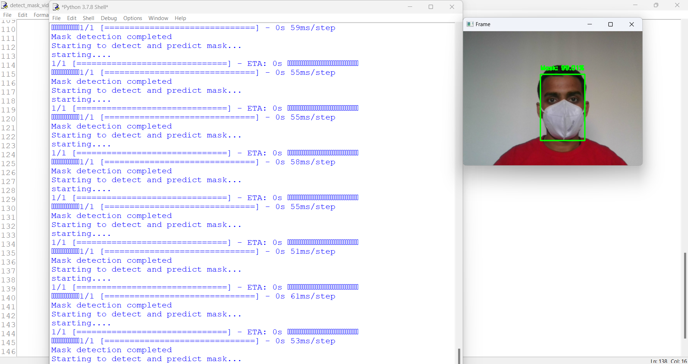
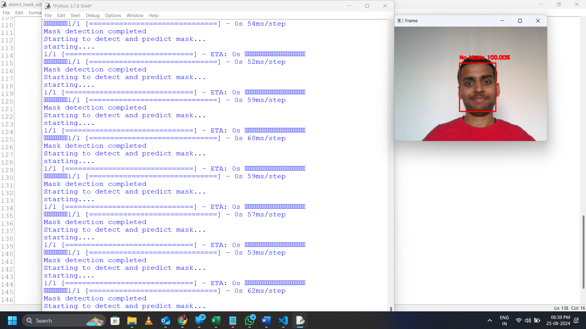

# Face-mask-detector

This project access the primary camera of the host device. Caputures the frame in real time, converts it in greyscale. Then it passes the frame to the CNN model which detects the face available in the picture and then predicts if they are wearing a mask or not.

We have set the threshould for final decision 50%. If the model is confident more then 50% if faces are wearing mask then it will make decision postive about wearing mask else not.

## Required Libraries

To run this project, you need to install the following Python libraries:

| Library        | Version             | Description                                                    |
|----------------|---------------------|----------------------------------------------------------------|
| `tensorflow`   | *latest*            | Provides deep learning tools including `keras` for model operations. |
| `imutils`      | *latest*            | Utilities for image processing tasks, including video streaming.  |
| `opencv-python`| *latest*            | Open source computer vision library for real-time image processing. |
| `numpy`        | *latest*            | Numerical computing library for handling arrays and matrices.    |

### Installation

You can install these libraries using the following command:

```bash
pip install tensorflow imutils opencv-python numpy
```

## Output
- Case: face is wearing mask


- Case: face is not wearing mask
